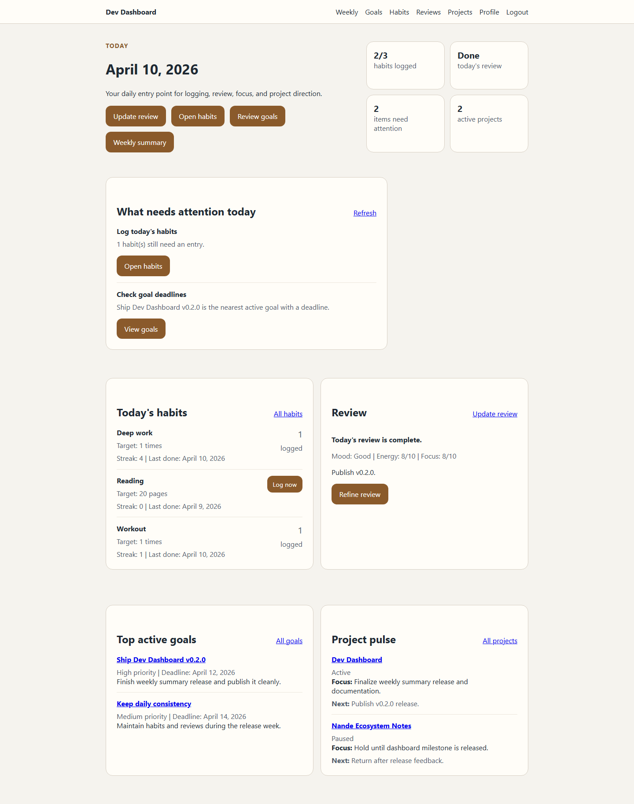
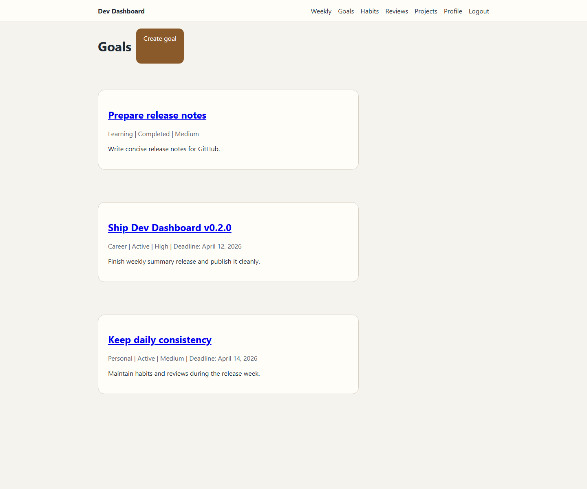
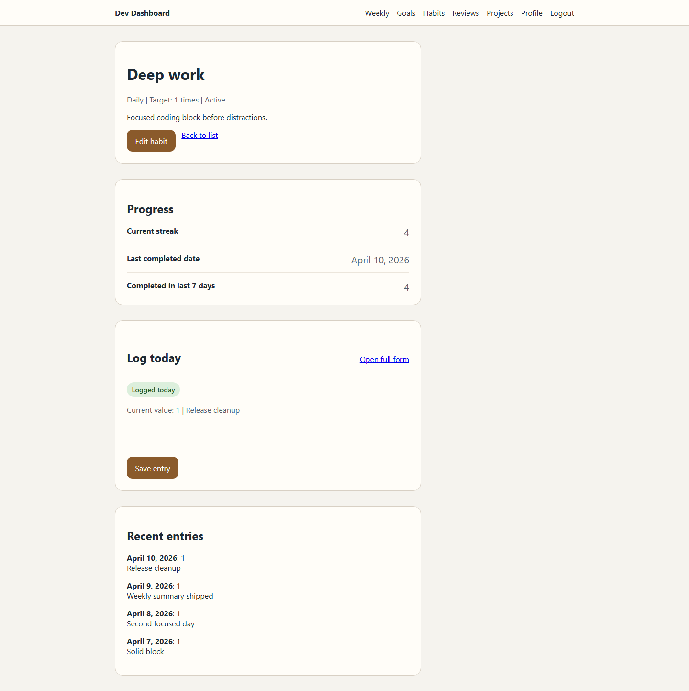
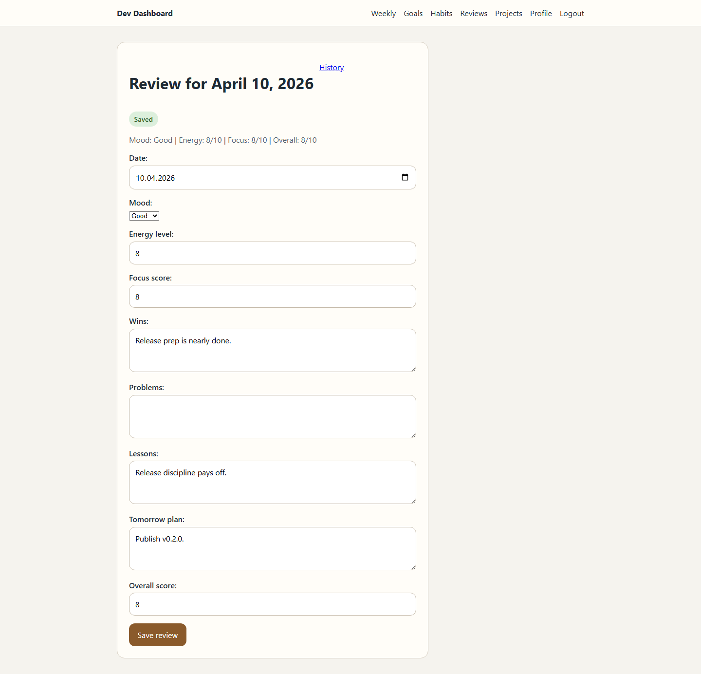
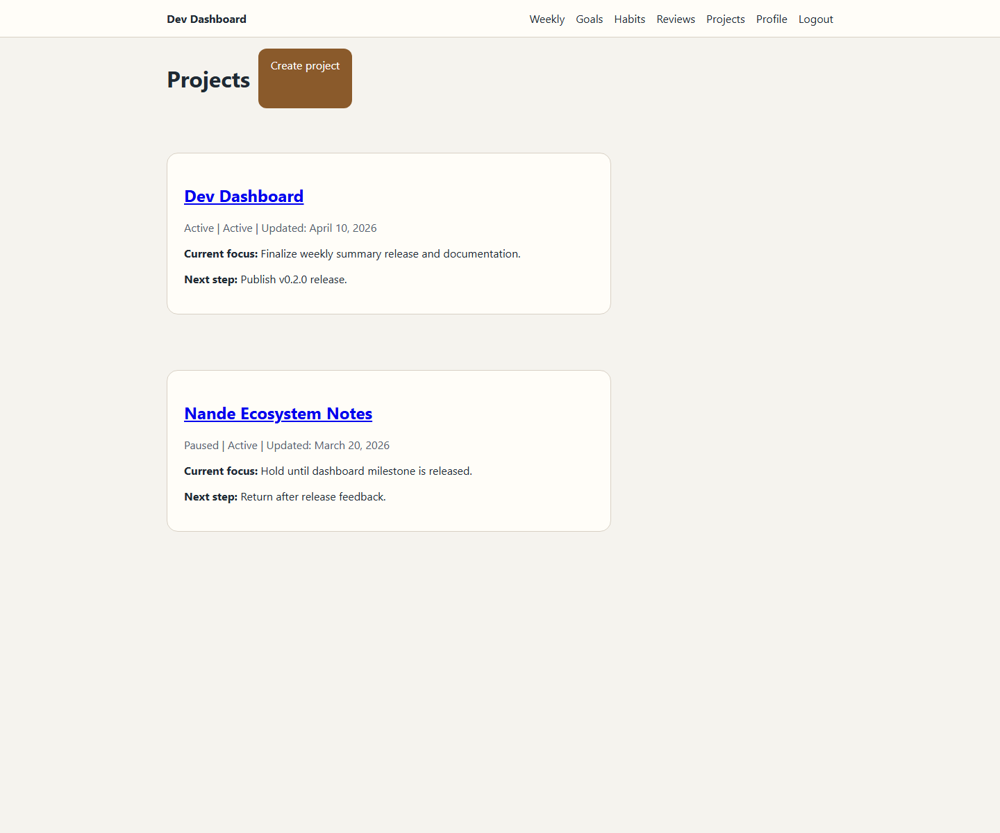
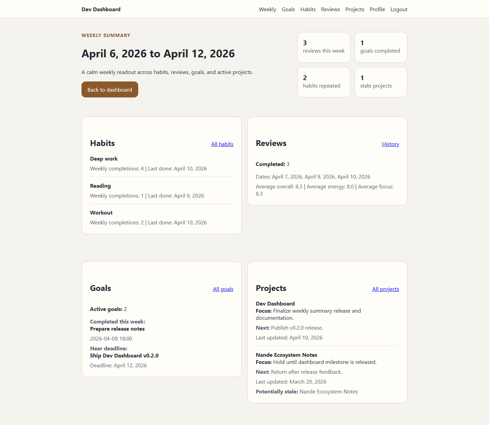

# Dev Dashboard

Dev Dashboard is a personal operating system for a developer.

It is designed to answer a small set of practical daily questions:

- What are my current important goals?
- What habits did I complete today?
- Did I review my day?
- Which personal projects are active right now?

The project is intentionally built as a serious personal tool and as a backend-focused portfolio project. The goal is not to build an all-in-one life platform on day one. The goal is to build a stable, useful core that is easy to extend later.

## Product Vision

Dev Dashboard combines a few essential workflows into one calm daily workspace:

- goals for medium- and long-term direction
- habits for daily discipline
- reviews for reflection and course correction
- project snapshots for lightweight project monitoring
- a homepage that aggregates the current state of the system

This is still a single-user product line. Multi-user support remains intentionally out of scope for the current version.

## Current Features

The current release includes:

- authentication with signup, login, logout, and profile page
- goal management
- habit management and daily habit entry logging
- lightweight habit progress layer:
  - current streak
  - last completed date
  - weekly completion count
- daily review creation and history
- project snapshot tracking
- dashboard homepage aggregation
- weekly summary page as a cross-domain read layer
- selective HTMX enhancements for high-frequency daily actions

Still out of scope:

- charts and analytics
- streak engine
- AI summaries
- reminders and notifications
- integrations
- calendar sync
- GitHub or ecosystem links beyond simple URLs

## Tech Stack

- Python 3.14
- Django 5.2
- Django Templates
- HTMX
- SQLite for local development
- PostgreSQL in production via `DATABASE_URL`

The frontend stays server-rendered. HTMX is used only where it reduces friction for repeated daily actions.

## Why This Architecture

The architecture is intentionally conservative.

The project favors explicit Django app boundaries, simple models, and thin HTTP layers. That keeps domain behavior testable, prevents business logic from leaking into templates, and makes later expansion safer.

Core architectural choices:

- writes go through `services.py`
- read-heavy queries and aggregations go through `selectors.py`
- views stay thin
- forms stay thin
- templates do not contain business logic
- dashboard acts as a read layer, not as a separate domain

This structure was chosen because it scales better than putting everything into models or views, but it is still lightweight enough for an MVP.

## Services / Selectors Pattern

The project uses a simple service-selector split.

### Services

Services handle state changes and business workflows.

Examples:

- `goals/services.py`
- `habits/services.py`
- `reviews/services.py`
- `projects_overview/services.py`

Typical responsibilities:

- create and update domain objects
- generate immutable slugs
- enforce workflow rules such as `completed_at` behavior
- wrap multi-step writes in `transaction.atomic()` where appropriate

### Selectors

Selectors handle query logic and aggregation.

Examples:

- `goals/selectors.py`
- `habits/selectors.py`
- `reviews/selectors.py`
- `projects_overview/selectors.py`
- `dashboard/selectors.py`

Typical responsibilities:

- list filtering
- lookup helpers
- recent-entry retrieval
- homepage aggregation across apps

This split keeps the read model and write model clear, which improves testing and reduces duplication across views.

## HTMX Strategy

HTMX is used selectively, not as the primary architecture.

Current HTMX use cases:

- habit logging without a full page reload
- today review save-and-refresh flow
- small block refreshes that improve daily mobile usage

Why this approach:

- it reduces friction for repeated daily actions
- it preserves a simple server-rendered architecture
- it avoids adding a frontend framework for a problem Django already solves well

## Database Strategy

The project uses a pragmatic database strategy:

- local development defaults to SQLite
- production uses PostgreSQL when `DATABASE_URL` is provided

This is configured in Django settings as:

- `DATABASE_URL` present -> parse and use PostgreSQL
- otherwise -> use local `db.sqlite3`

Why this approach:

- SQLite keeps local setup fast and simple
- PostgreSQL remains available for deployment realism
- the MVP avoids PostgreSQL-only model features, which keeps the application portable

## Project Structure

```text
Dev Dashboard/
|-- accounts/
|-- api/
|-- config/
|-- core/
|-- dashboard/
|-- goals/
|-- habits/
|-- projects_overview/
|-- reviews/
|-- static/
|-- templates/
|-- .env.example
|-- manage.py
|-- README.md
`-- requirements.txt
```

App responsibilities:

- `accounts`: auth and profile
- `goals`: meaningful objectives and lifecycle management
- `habits`: habits and daily entry logging
- `reviews`: daily reflections
- `projects_overview`: high-level project monitoring
- `dashboard`: aggregated homepage read layer
- `api`: reserved for future integrations
- `core`: shared utilities only

## Domain Overview

### Profile

Uses Django `User` plus a minimal `Profile`.

### Goal

Represents meaningful objectives with:

- immutable auto-generated slug
- type, status, and priority choices
- deadline support
- completion tracking through `completed_at`
- archive flag for lifecycle management

### Habit

Represents repeatable behavior with:

- immutable auto-generated slug
- frequency, target count, and unit
- active/inactive state

### HabitEntry

Tracks habit completion by day using a simple integer `value`.

Examples:

- `1` for done
- `0` for not done
- higher values for count-based habits

Database rule:

- one `HabitEntry` per habit per date

### DailyReview

Represents a daily reflection with:

- one review per date
- mood, energy, focus, overall score
- wins, problems, lessons, tomorrow plan

### ProjectSnapshot

Represents a high-level project monitor with:

- immutable auto-generated slug
- practical status choices
- `current_focus`
- `next_step`
- optional repo/demo URLs

This is intentionally not a task manager.

## Dashboard Homepage

The homepage aggregates the information needed most often during the day:

- today's habits
- today's review state
- top active goals
- active project snapshots

The dashboard is designed to stay useful and uncluttered. It should be readable on desktop and comfortable on mobile.

## Weekly Summary

The weekly summary is a read-only reflection layer built on top of the existing core data.

It aggregates:

- weekly habit completion counts
- habits with no completions during the week
- review coverage and average scores
- active goals, completed goals, and near-deadline goals
- active project focus and next-step visibility

It is intentionally not a reporting engine. The goal is to support weekly reflection, not build analytics for analytics' sake.

## Setup

### 1. Create a virtual environment

```powershell
python -m venv .venv
.venv\Scripts\Activate.ps1
```

### 2. Install dependencies

```powershell
python -m pip install -r requirements.txt
```

### 3. Create local environment variables

```powershell
Copy-Item .env.example .env
```

Update `.env` if needed:

```env
DEBUG=True
SECRET_KEY=change-me
ALLOWED_HOSTS=127.0.0.1,localhost,testserver
TIME_ZONE=Asia/Yekaterinburg
DATABASE_URL=
```

### 4. Run migrations

```powershell
python manage.py migrate
```

### 5. Create an admin user

```powershell
python manage.py createsuperuser
```

### 6. Start the development server

```powershell
python manage.py runserver
```

Open:

- `http://127.0.0.1:8000/`
- `http://127.0.0.1:8000/admin/`

## Running Tests

Run the workflow-oriented test suite:

```powershell
python manage.py test goals habits reviews projects_overview dashboard
```

Run Django system checks:

```powershell
python manage.py check
```

## Screenshots

### Dashboard Home



### Goals



### Habits



### Today Review



### Project Overview



### Weekly Summary



## Current Quality Focus

This project prioritizes:

- explicit architecture
- clean domain boundaries
- useful MVP behavior
- low-friction daily interactions
- test coverage around workflows and invariants

It intentionally does not prioritize visual complexity or speculative features over maintainability.

## Future Extensions

Possible future work after the MVP:

- streak analytics
- deeper dashboards
- integrations
- ecosystem linking

Those are postponed intentionally until the current core proves itself in real use.
